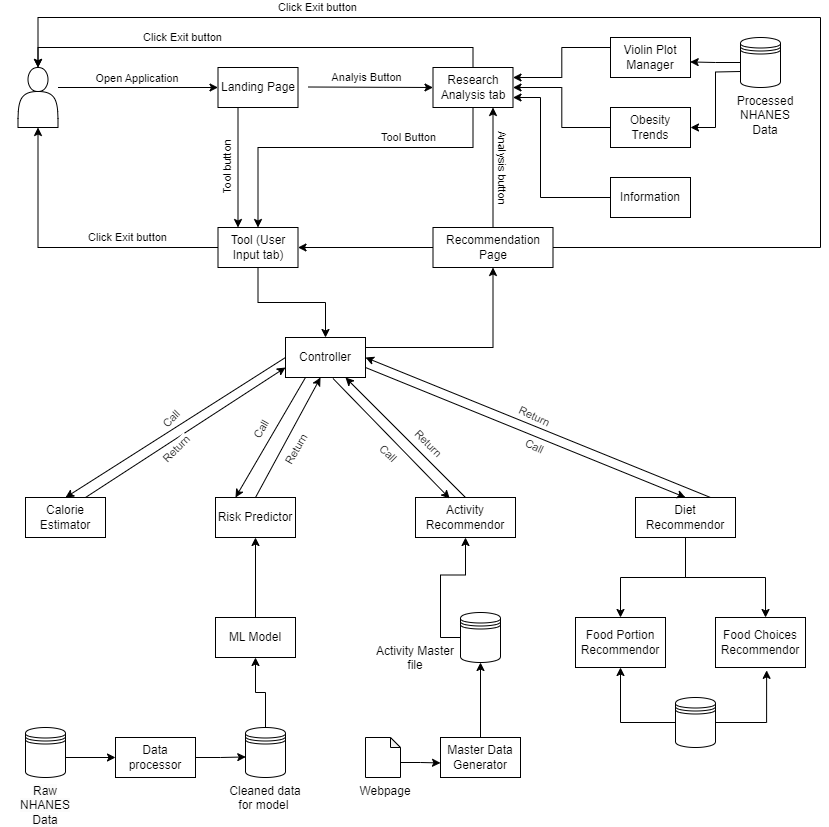

# Component Specification

## Software Components
### Data Analysis
__Name__: Violin Plot Manager  
__What It Does__: Reads NHANES data into a dataframe, process it, and then plot the distribution with
violin plots.
__Inputs__: String: Type of data to visualize - e.g. Weight, BMI, Physical Activity, etc.   
__Inputs__: List: List of years to visualize.   
__Outputs__: Object: Violin plot  
__Assumptions__: Data is NOT cleaned - needs to be checked for NaNs, bad data.

__Name__: Background Information NHANES  
__What It Does__: Reads NHANES data into a dataframe. Visualizes proportion of overweight and obesity in United States over time.
__Inputs__: List: Years of data to visualize.
__Outputs__: Object: Bar plots showing prevalence of obesity of sex, race, age.  
__Assumptions__: Data is NOT cleaned - needs to be checked for NaNs, bad data.

__Name__: Background Information IHME
__What It Does__: Reads IHME data into a dataframe. Generates plots visualizing data on risk factors of death - particularly
highlighting obesity in the rankings.
__Inputs__: List: List of years to visualize.
__Outputs__: Object: Bar plot.
__Assumptions__: Data is not cleaned - neds to be checked for NaNs, bad data.

__Name__: Obesity Trends  
__What It Does__: Reads NHANES BMI and Demographic information. Visualizes obesity trends in groups 
such as:  Sex, Race, Age.
__Inputs__: List: List of years to visualize.  
__Outputs__: Object: Line plot displaying a obesity trend over time.  
__Assumptions__: Data is NOT cleaned - needs to be checked for NaNs, bad data.

### Machine Learning
__Name__: Data Processor.  
__What It Does__: Uses the raw data of NHANES to process and prepare a dataset that is suitable to build and train the model. Processing includes data operations such as data cleaning, remove null values or replace with valid values, add bmi column, add is_obese binary column.   
__Inputs__: Full raw dataset from NHANES.  
__Outputs__: Clean dataset.  
__Assumptions__: Any symbols, blank spaces are treated as invalid values, height and weight are the only columns determining the BMI & obesity level. No lab data is known. 

__Name__: Machine Learning Model.    
__What It Does__: Builds and trains the model using logistic regression on the dataset generated by the data processor component.   
__Inputs__: Dataset generated by the data processor.  
__Outputs__: Machine Learning model saved to the local system.   
__Assumptions__: Dataset is clean and is handled for null values. The fields in the dataset are the only factors that influence obesity keeping all external factors at constant.

__Name__: Risk Predictor.  
__What It Does__:  Using the user input data, and model generated by ML model components, predicts the obesity risk for the individual.  
__Inputs__: Model from ML Model component, list -  User personal data including anthropometric data and lifestyle factors.  
__Outputs__: Number - predicting the percentage of risk.  
__Assumptions__: Prediction based only the data, the user inputs for fields that we have defined & disregarding any additional factors contributing to obesity that is not within the scope of the tool.

### Recommendation Tool
__Name__: Calorie Estimator.   
__What It Does__: Calculates & displays the estimated calorie need for the individual to stay fit based on the inputs provided.    
__Inputs__: List - User input data such as age, gender, height, weight and activity level.  
__Outputs__: Number - expressing the calorie need in kcal.  
__Assumptions__: Using the standard formula to calculate the calorie need, no other body vital data is considered.

__Name__: Activity Master Data generator.  
__What It Does__: Scrape teh data from the webpage and create a cv file which serves are master file for the physical activity recommender.   
__Inputs__: Webpage.  
__Outputs__: Clean csv file.  
__Assumptions__: The activity & estimated calorie burn is same for both male and female and all ages. Only influencing factor is the body weight. 

__Name__: Activity Recommender.    
__What It Does__: Calculates & displays the suitable physical activities along with duration & expected calorie burned, based on user preference. Display one moderate intensity workout in each category for 30 minutes duration by default, if user preference is provided then the customized activities are listed.   
__Inputs__: List - user data such as age, height, weight and activity levels, specific preference such as activity intensity , type of activity (sports, gym etc).  
__Outputs__: List of tuples - Activity type, activity name, duration and expected calorie burn.  
__Assumptions__: The calorie burn does not vary from person to person based on health conditions, standardized for the given inputs.

__Name__: Food portion recommendation.  
__What It Does__: Displays the amount of each food groups that should be consumed by the user in a day.  
__Inputs__: List - user data such as age, gender, food preference.  
__Outputs__: tuple - minimum and maximum quantity of each food group.  
__Assumptions__: The quantities are referred from USDA website.  

__Name__: Food choices recommendation.  
__What It Does__: Displays the list of food in a given food group with calorie/fat/protein levels based on user input.  
__Inputs__: List - user data such as age, gender, food preference, goal(weight loss/gain).  
__Outputs__: List - Output a list of primary food varieties.  
__Assumptions__: The food list and the calorie content are referred from USDA website.  

### User Interface
__Name__: Landing page  
__What It Does__: Provide a brief introduction to the website and guide users to navigate to their specific requests (Welcome message or brief description, Navigation links or buttons leading to the Research/Data Analysis, Tab and Tool (User Input) Tab, Maybe an overview of the website's mission or key features).

__Name__: Research/Data analysis Tab     
__What It Does__: Briefly explain about obesity, its trends over time, and its connections to various lifestyle factors through visualizations  to users.  
__Inputs__: Options for users to limit visualization options (e.g., time range, specific factors), Zoom and filter options for interactive exploration.  
__Output__: Talk users through the visualizations and explaining their significance.

__Name__: Tool (user input) Tab  
__What It Does__: Allow users to input their data for risk prediction and receive personalized recommendations related to diet and physical activity.  
__Inputs__: Input form for basic user information (age, weight, height, etc.), Perform Field validation checks to handle potential incorrect inputs, Integrate with risk prediction and recommendation system functions.  
__Output__: Rendered webpage that shows the tool output: Obesity risk level (Hazard ratio), Standard and personalized recommendations.

## Interactions for Accomplishing Use Cases

### Interaction Diagram

### Brief Description
Below is a brief explanation of the interactions between the user and the web application,
- **User Opens the Application:** As soon as the user opens the application, it directs to the landing page, which displays an overview of the application's features. The user now has an option to view the Research Analysis tab (or) use the Tool.
- **Analysis tab:** As The user clicks on the "Analysis" button, it takes them to the Analysis tab. This tab displays various charts and information about obesity that can help the user know about the trends/the health issue in general. 
- **Tool (User Input) tab:** When the user clicks on the "Tool" button, it takes them to the Tool (User Input) tab.This tab allows the user to input personal data, such as their age, weight, height, activity level, etc. The user can also click on the "Information" button to learn more about how the tool works.
- **Calorie Estimator, Risk Predictor, Activity Recommender, and Diet Recommender:** Once the user has entered their data, they can click on the "Calculate" button. This will send their data to the Calorie Estimator, Risk Predictor, Activity Recommender, and Diet Recommender models. These models will use the user's data to generate personalized recommendations for calorie intake, physical activity, and diet.
- **Recommendations:** The recommendations are displayed on the Recommendation Page. The user can review the recommendations and make changes to their input data if necessary.
- **User Exits the Application:** The user can click on the "Exit" button to exit the application.