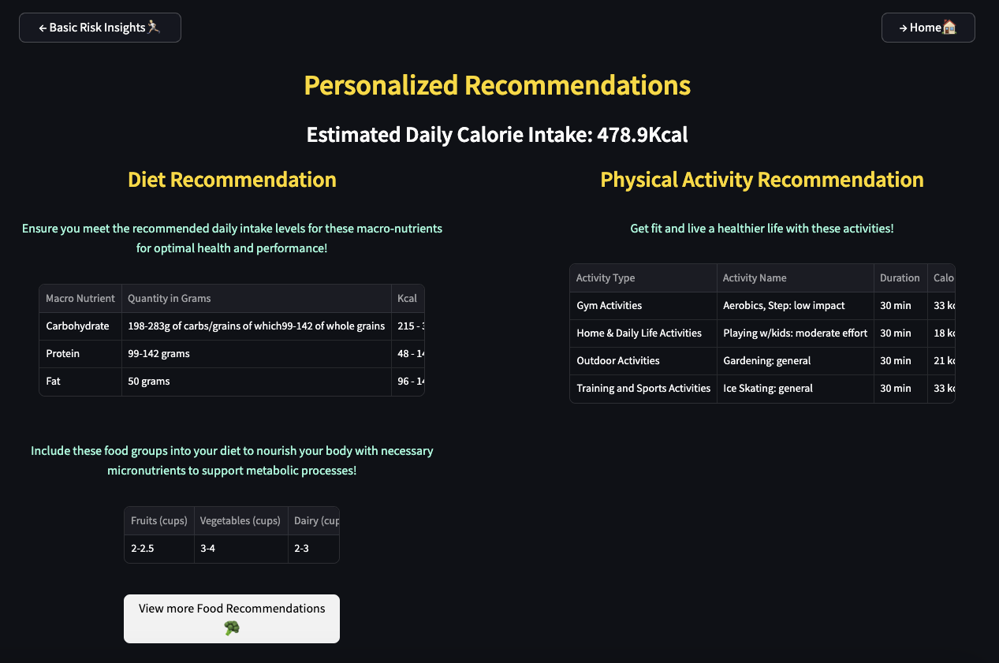

# This your text guide on how to use the tool - LiveLite

   

## Homepage
Upon launching the app, the home page introduces you to the tool and the functionalities available in the tool. Clicking on either of the available buttom will take you to the next pages respectively.

   

## Understand Obesity
You can navigate to this page by clicking on "understand obesity" button in homepage. This scrollable page prvoides you a detailed analysis of the reserach on obesity, its causes and effects over the years. Each plot in this page can be viewed in full screen and can be zoomed in for a part of the plot that interests you, use the icons as shown.

   

## Risk Insights Form Page
Navigate to this page by clicking on "Your Risk Insights" button either from Home page or the Understand obesity page. Fill up the form in this to view your obesity risk, for the unfilled fields, default value will be submitted. So for accurate resluts fill in all the fields. Upon form submission, you will be redirected to risk insights page.

   

## Risk Insights Page
This page provide you with assesses risk score and enables you to find recommendations of healthy lifestyles such as good food & physical activities. select your diet preference and exercise preference click on "View Personalized recommendation" button.

   

## Personalized Recommendation
This page provides you with recommendations customised for you. If you are interested in knowing more abot particular food item of your choice, click on "view  more food recommendations" button.

   

## Food Recommendation
In this page you can either choose a food category of your choice ot see details of all food items under the selected category or type text to search for a particular food item and you can view very detailed information about the consumption of the food item.

   
Use the buttons in the top corners of each page to easily navigate to home page or the previous page.
